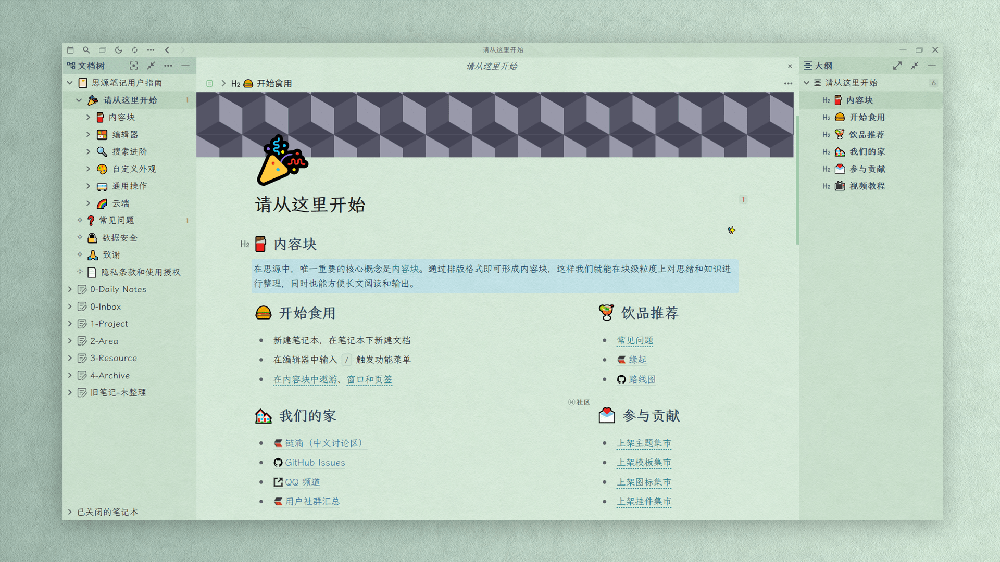

<h1 align="center">Tsundoku(green): A Theme for SiYuan Note</h1>

          
           
           
           
           <a href="https://github.com/Achuan-2/siyuan-themes-tsundoku-green/releases">
                      <https://img.shields.io/github/release/Achuan-2/siyuan-themes-tsundoku-green.svg" alt="Release">
           </a>
           
           
           
          

> 🎠 这可能不会是最符合你审美的主题，但或许会是一个最追求极致体验的主题（之一）！
> 
> 🌞 亮色主题见[Tsundoku Light](https://github.com/Achuan-2/siyuan-themes-tsundoku-light) | 🌛 深色主题见[Tsundoku Dark ](https://github.com/Achuan-2/siyuan-themes-tsundoku) | 🥗 护眼主题见[Tsundoku Green](https://github.com/Achuan-2/siyuan-themes-tsundoku-green)
> 

## 💌 **缘起**

Tsundoku “積 ん 読”是日语里的一个词，维基百科是这样解释的“Tsundoku is acquiring reading materials but letting them pile up in one's home without reading them. It is also used to refer to books ready for reading later when they are on a bookshelf.”

> Any PKM approach that doesn’t tie into execution tools is destined to languish on the back burner forever

我借此名来警醒自己，希望思源能帮助我成长，帮我更好的完成任务，而不是又成为一个缓解知识焦虑的积灰箱，满足我的数字化囤积症。

## ✨主要特色
                                                                                                                             
* **标题样式优化**: 

* **动效丰富**：块引用鼠标悬浮预览页面展开动效、悬浮在按钮图标上有放大效果等待，提升用户在写作和阅读时的体验。
* **任务列表样式优化**：对任务列表效果做了很多的优化，当把任务列表勾选时，普通文字变色加删除线，并针对完成的任务列表中的各个行内和块样式都做了一定处理。完成的任务列表中的图片和代码块透明度降低
* **win端和安卓端emoji样式统一**：修改**安卓端的默认 emoji** 为 Win 10 emoji——Segoe UI Emoji，保证emoji样式统一
* **代码块样式调整**
* 纸张纹理背景

## 💥本主题重要的修改

1. 本主题暂时将高亮<kbd>Ctrl+E</kbd>,设置为挖空效果：悬浮时才显示高亮的文字，默认隐藏文字

   * 如果需要取消该效果，请在主题 css 中搜索「挖空」关键词，将所提示的代码删除
2. 添加了自定义块属性样式

   * 属性 key 都为 function
   * value 可为

     * zy ——代表重要
     * ing ——代表进行中
     * done ——代表事项已完成
     * 50 ——代表完成 50%
     * kaiti ——字体为楷体
     * 挖空——挖空效果
     * 黄——黄背景色
     * 蓝——蓝色背景色
     * 红——红色背景色
   * 使用方式：单击块标选择打开属性列表或<kbd>Shift+Click</kbd>打开，点击<kbd>添加</kbd>，输入属性名为function，并输入相应的属性值（如“挖空”）
   * 预览图：
3. 对文字样式进行了自定义

   | 状态     | 配色情况                                                                                        |
   | -------- | ----------------------------------------------------------------------------------------------- |
   | 修改前   |  |
   | 修改后： | |

## **☎️意见交流**

若主题存在样式的问题，欢迎在此repo提issue或是通过邮箱联系我(achuan-2@outlook.com)。在提issue之前建议先切换为默认主题，确定是本主题特有的问题。

## **🚀更新情况**

见[更新日志](CHANGE_LOGS.md)
